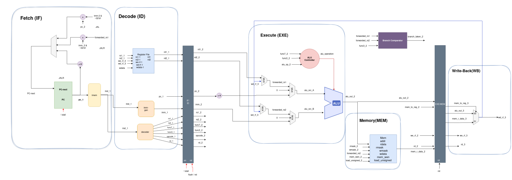
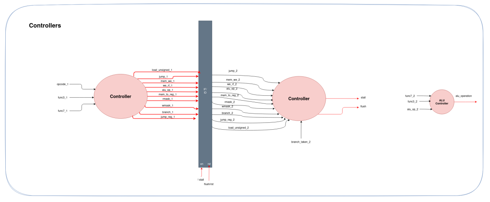
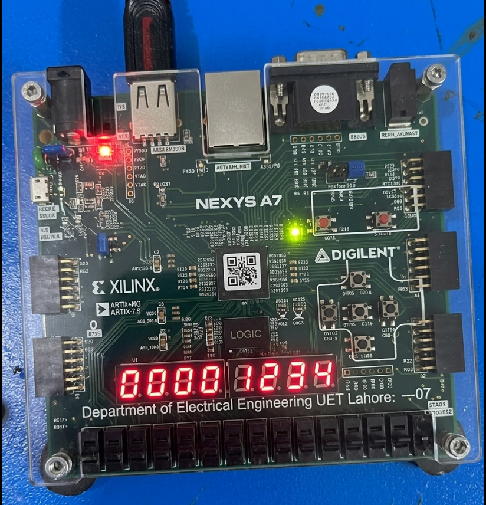

# riscv-pipelined-processor

This repository contains a simple 3-stage pipelined RISC-V processor design.

## DataPath

## Controller

## Project layout

- `src/` — SystemVerilog RTL modules
- `tests/` — Verilator-driven module and CPU testbenches
- `Makefile` — build and run tests with `verilator`

## Run tests

- `make test` — compile and execute all tests
- `make tb_cpu` — run the full CPU integration test only
- `make clean` — remove generated Verilator build files

## Synthesis on FPGA
Succesfully synthesized it on Nexys a7 FPGA. We run insertion sort.

